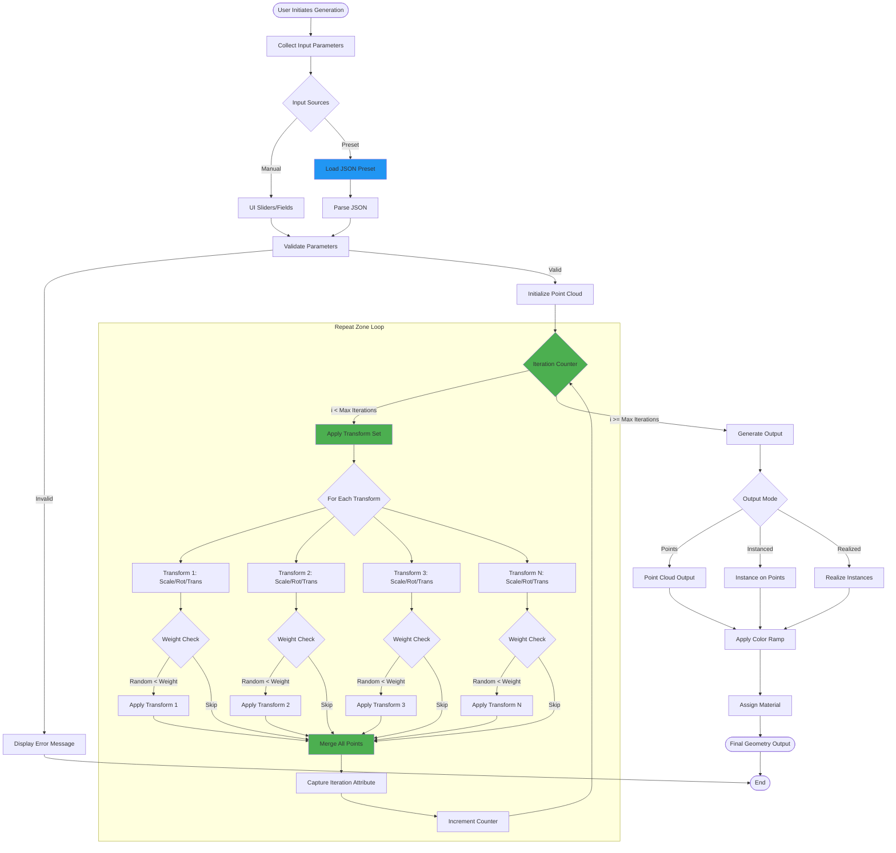
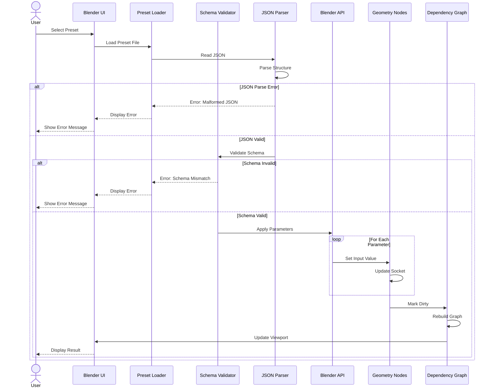
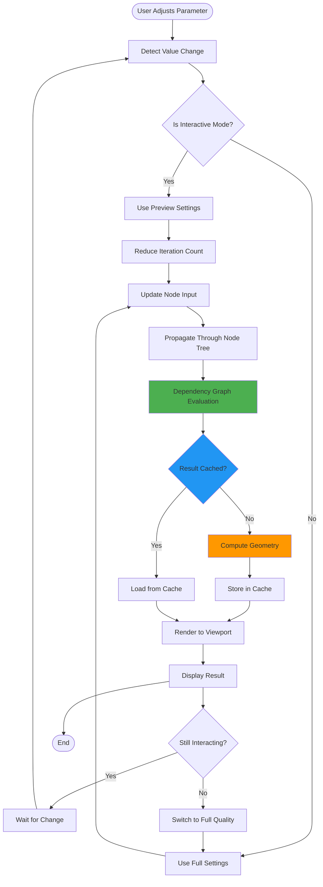
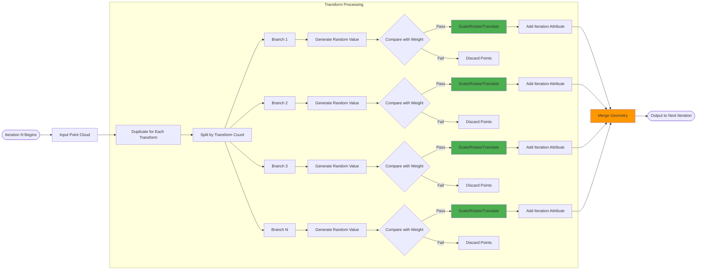
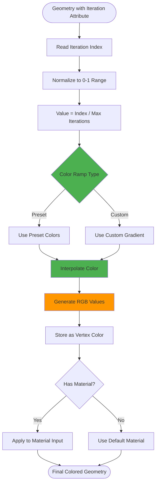
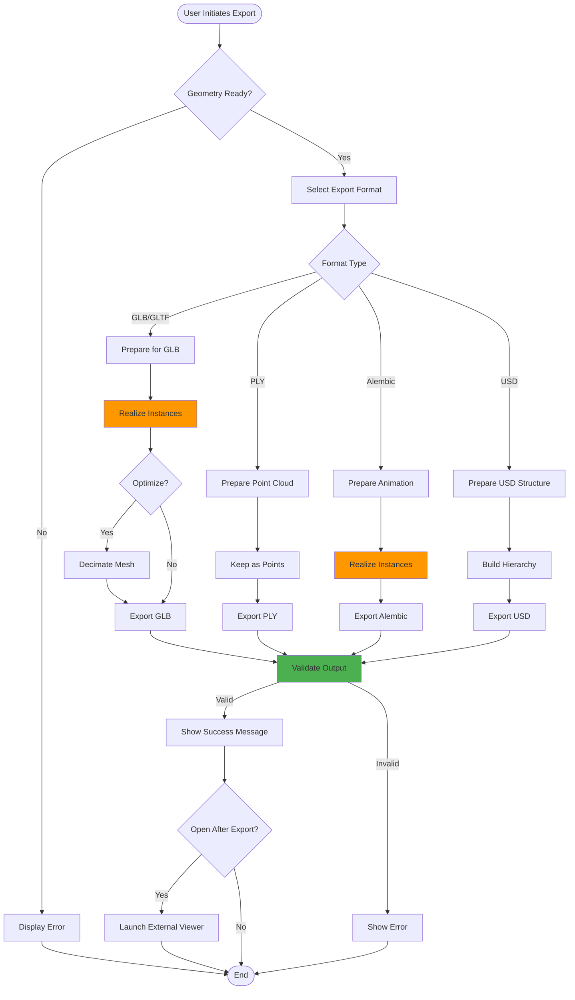
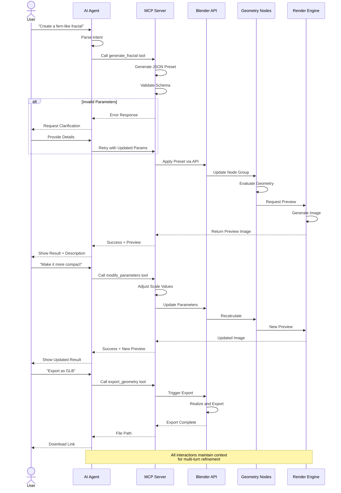

# Data Flow Diagrams

## 1. Core IFS Generation Flow

This diagram shows how data flows through the geometry generation pipeline.

---

## 2. Preset Loading Flow

Detailed flow of how JSON presets are loaded and applied.

---

## 3. Parameter Update Flow (Real-Time Interaction)

Shows the flow when user adjusts parameters in real-time.

---

## 4. Transform Application Logic Flow

Detailed view of how transforms are applied within a single iteration.

---

## 5. Color Mapping Flow

How iteration depth is converted to color gradients.

---

## 6. Export Pipeline Flow

Data flow for exporting fractals to various formats.

---

## 7. Future: MCP Agent Interaction Flow

Planned data flow for AI agent-driven fractal generation.

---

## Data Flow Summary

| Flow Type | Complexity | Performance Impact | Caching Possible |
|-----------|------------|-------------------|------------------|
| Core Generation | High | High (exponential) | Partial |
| Preset Loading | Low | Minimal | Full |
| Parameter Update | Medium | Medium | Yes |
| Transform Logic | High | High | No |
| Color Mapping | Low | Low | Yes |
| Export Pipeline | Medium | Medium | No |
| MCP Interaction | Medium | Low (async) | Yes |

---

## Performance Considerations

- **Bottleneck**: Transform application and merge operations in repeat zone
- **Optimization Strategy**: Minimize point count via probabilistic culling
- **Caching**: Dependency graph caches unchanged subtrees
- **Future**: GPU compute shaders for transform operations

