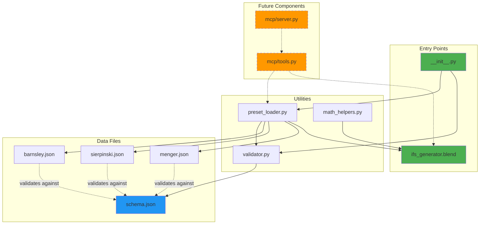
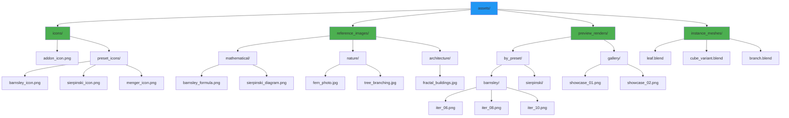
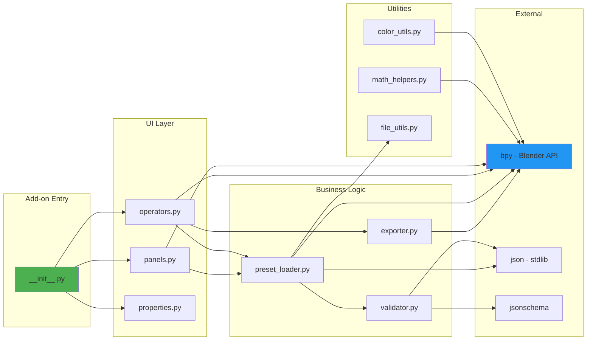
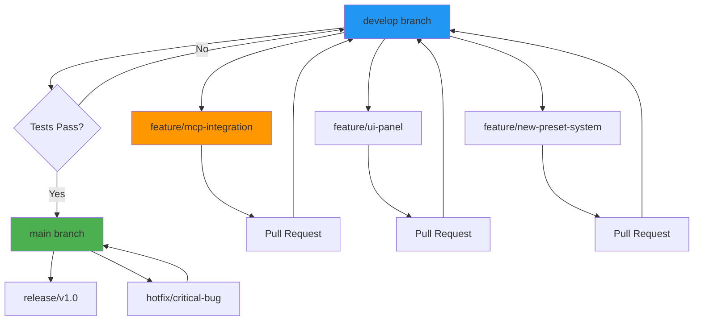

# Project Folder Structure Diagrams

## 1. Current Repository Structure

Visual representation of the existing folder layout.

```mermaid
graph TD
    Root[IFS-Fractal-Generator/]
    
    Root --> README[README.md]
    Root --> Idea[Idea.md]
    Root --> Structure[structure.md]
    Root --> Template[README-TEMPLATE.md]
    
    Root --> Docs[docs/]
    Root --> Src[src/]
    Root --> Assets[assets/]
    
    Docs --> DocsArch[architecture.md]
    Docs --> DocsPlan[development-plan.md]
    Docs --> DocsDiag[diagrams/]
    
    DocsDiag --> DiagSys[system-overview.md]
    DocsDiag --> DiagFlow[data-flow.md]
    DocsDiag --> DiagFolder[folder-structure.md]
    DocsDiag --> DiagInt[interaction-map.md]
    
    Src --> SrcInit[__init__.py]
    Src --> SrcGeo[geometry_nodes/]
    Src --> SrcPre[presets/]
    Src --> SrcUtil[utils/]
    Src --> SrcMCP[mcp/]
    
    SrcGeo --> GeoBlend[ifs_generator.blend]
    SrcGeo --> GeoDoc[node_documentation.md]
    
    SrcPre --> PreBarn[barnsley.json]
    SrcPre --> PreSier[sierpinski.json]
    SrcPre --> PreMeng[menger.json]
    SrcPre --> PreSchema[schema.json]
    
    SrcUtil --> UtilInit[__init__.py]
    SrcUtil --> UtilLoad[preset_loader.py]
    SrcUtil --> UtilValid[validator.py]
    SrcUtil --> UtilMath[math_helpers.py]
    
    SrcMCP --> MCPRead[README.md]
    SrcMCP --> MCPServ[server.py]
    SrcMCP --> MCPTools[tools.py]
    
    Assets --> AssIcon[icons/]
    Assets --> AssRef[reference_images/]
    Assets --> AssPrev[preview_renders/]
    
    AssIcon --> IconAddon[addon_icon.png]
    AssRef --> RefFern[barnsley_reference.png]
    AssRef --> RefSier[sierpinski_reference.png]
    AssPrev --> PrevBarn[barnsley_render.png]
    AssPrev --> PrevSier[sierpinski_render.png]
    
    style Root fill:#4CAF50
    style Docs fill:#2196F3
    style Src fill:#2196F3
    style Assets fill:#2196F3
    style SrcMCP fill:#FF9800
```



---

## 2. Folder Organization by Function

Categorized view showing functional grouping.

```mermaid
graph LR
    subgraph "Documentation"
        D1[docs/architecture.md]
        D2[docs/development-plan.md]
        D3[docs/diagrams/]
        D4[README.md]
    end
    
    subgraph "Core Implementation"
        C1[src/geometry_nodes/]
        C2[src/utils/]
        C3[src/__init__.py]
    end
    
    subgraph "Configuration"
        CF1[src/presets/*.json]
        CF2[src/presets/schema.json]
    end
    
    subgraph "Visual Assets"
        A1[assets/icons/]
        A2[assets/reference_images/]
        A3[assets/preview_renders/]
    end
    
    subgraph "Future Integration"
        F1[src/mcp/server.py]
        F2[src/mcp/tools.py]
    end
    
    style "Core Implementation" fill:#4CAF50
    style "Configuration" fill:#2196F3
    style "Future Integration" fill:#FF9800
```

---

## 3. File Dependency Map

Shows which files depend on or reference others.



---

## 4. Preset Organization Hierarchy

Detailed view of the preset system structure.

```mermaid
graph TD
    Root[src/presets/]
    
    Root --> Schema[schema.json]
    Root --> Classic[Classic Fractals]
    Root --> Organic[Organic Forms]
    Root --> Experimental[Experimental]
    Root --> UserPresets[User Presets]
    
    Classic --> C1[barnsley.json]
    Classic --> C2[sierpinski.json]
    Classic --> C3[menger.json]
    Classic --> C4[sierpinski_carpet.json]
    
    Organic --> O1[tree_01.json]
    Organic --> O2[tree_02.json]
    Organic --> O3[fern_variant.json]
    Organic --> O4[coral.json]
    
    Experimental --> X1[spiral.json]
    Experimental --> X2[dragon_curve.json]
    Experimental --> X3[custom_01.json]
    
    UserPresets --> U1[...]
    UserPresets --> U2[user_created.json]
    
    Schema -.->|validates| C1
    Schema -.->|validates| C2
    Schema -.->|validates| C3
    Schema -.->|validates| C4
    Schema -.->|validates| O1
    Schema -.->|validates| O2
    Schema -.->|validates| O3
    Schema -.->|validates| O4
    Schema -.->|validates| X1
    Schema -.->|validates| X2
    Schema -.->|validates| X3
    Schema -.->|validates| U2
    
    style Schema fill:#2196F3
    style Classic fill:#4CAF50
    style Organic fill:#4CAF50
    style Experimental fill:#FF9800
    style UserPresets fill:#9E9E9E
```



---

## 5. Asset Organization Structure

How visual and reference assets are organized.



---

## 6. Documentation Structure

How documentation files are organized.

```mermaid
graph TD
    Docs[docs/]
    
    Docs --> Core[Core Documentation]
    Docs --> Diagrams[diagrams/]
    Docs --> Guides[guides/]
    Docs --> API[api/]
    
    Core --> C1[architecture.md]
    Core --> C2[development-plan.md]
    Core --> C3[glossary.md]
    Core --> C4[changelog.md]
    
    Diagrams --> D1[system-overview.md]
    Diagrams --> D2[data-flow.md]
    Diagrams --> D3[folder-structure.md]
    Diagrams --> D4[interaction-map.md]
    
    Guides --> G1[getting-started.md]
    Guides --> G2[creating-presets.md]
    Guides --> G3[advanced-techniques.md]
    Guides --> G4[troubleshooting.md]
    
    API --> A1[preset-schema.md]
    API --> A2[node-interface.md]
    API --> A3[python-api.md]
    API --> A4[mcp-integration.md]
    
    style Docs fill:#2196F3
    style Core fill:#4CAF50
    style Diagrams fill:#4CAF50
    style Guides fill:#4CAF50
    style API fill:#FF9800
```



---

## 7. Module Import Structure

Shows Python module import relationships.



---

## Folder Structure Best Practices

### Naming Conventions
- **Descriptive**: File names clearly indicate content
- **Lowercase**: Use snake_case for Python modules
- **Consistent**: Similar files use similar naming patterns
- **Versioned**: Node groups and assets include version info

### Organization Principles
1. **Separation of Concerns**: Code, data, documentation, and assets in distinct folders
2. **Scalability**: Structure supports growth without reorganization
3. **Discoverability**: Logical grouping makes files easy to find
4. **Modularity**: Each folder can be developed/tested independently

### Future Expansion
As the project grows, consider:
- `tests/` folder for unit and integration tests
- `scripts/` for utility scripts and automation
- `examples/` for example scenes and tutorials
- `contrib/` for community contributions

---

## Navigation Guide

| Need to... | Look in... |
|------------|-----------|
| Understand system design | `docs/architecture.md` |
| See development roadmap | `docs/development-plan.md` |
| Find visual diagrams | `docs/diagrams/` |
| Access core node group | `src/geometry_nodes/ifs_generator.blend` |
| Add/modify presets | `src/presets/` |
| Extend functionality | `src/utils/` |
| Work on MCP integration | `src/mcp/` |
| View reference images | `assets/reference_images/` |
| See example renders | `assets/preview_renders/` |

---

## Version Control Strategy



**Protected Branches**: `main`, `develop`  
**Required Reviews**: 1 for features, 2 for releases  
**CI/CD**: Automated validation of JSON schemas, Python syntax

