# Component Interaction Maps

## 1. User Workflow Sequence

Complete sequence of a typical user session.

```mermaid
sequenceDiagram
    actor User
    participant Blender as Blender Application
    participant UI as Add-on UI Panel
    participant Loader as Preset Loader
    participant Nodes as Geometry Nodes
    participant Viewport as 3D Viewport
    
    User->>Blender: Launch Blender
    Blender->>UI: Load Add-on
    UI->>UI: Initialize Panel
    
    User->>UI: Click "Add Fractal"
    UI->>Loader: Request Default Preset
    Loader->>Loader: Load barnsley.json
    Loader->>Nodes: Create Node Group
    Nodes->>Nodes: Initialize with Preset
    
    Nodes->>Viewport: Generate Preview
    Viewport-->>User: Display Fractal (6 iterations)
    
    User->>UI: Adjust Iterations Slider (10)
    UI->>Nodes: Update Iterations Input
    Nodes->>Nodes: Recalculate Geometry
    Nodes->>Viewport: Update Display
    Viewport-->>User: Show Updated Fractal
    
    User->>UI: Change Preset to "Sierpiński"
    UI->>Loader: Load sierpinski.json
    Loader->>Nodes: Apply New Parameters
    Nodes->>Viewport: Regenerate
    Viewport-->>User: Display New Fractal
    
    User->>UI: Adjust Color Ramp
    UI->>Nodes: Update Color Params
    Nodes->>Viewport: Update Colors
    Viewport-->>User: Show Recolored Result
    
    User->>UI: Click "Export GLB"
    UI->>Nodes: Realize Instances
    Nodes->>Blender: Export Geometry
    Blender->>Blender: Write GLB File
    Blender-->>UI: Export Complete
    UI-->>User: Show Success Message
```

---

## 2. Preset Loading Interaction

Detailed interaction during preset loading.

---

## 3. Real-Time Parameter Adjustment

How the system responds to live parameter changes.

---

## 4. Node Group Internal Communication

How nodes communicate within the IFS generator.

---

## 5. Future: MCP Agent Workflow

Planned interaction pattern with AI agents.

---

## 6. Multi-User Collaboration (Future Concept)

Conceptual interaction for shared fractal editing.

---

## 7. Batch Processing Workflow

Interaction for generating multiple fractal variations.

---

## 8. Error Handling Flow

How errors propagate through the system.

---

## Interaction Patterns Summary

| Pattern | Complexity | User Involvement | Automation Level |
|---------|------------|------------------|------------------|
| Manual Preset Load | Low | High | None |
| Parameter Adjustment | Low | Continuous | Real-time feedback |
| Agent Generation | Medium | Initial + Refinement | High |
| Batch Processing | High | Initial Setup | Full |
| Collaborative Edit | High | Multi-user | Synchronized |
| Error Recovery | Variable | Context-dependent | Semi-automatic |

---

## Design Principles

### Responsiveness
- All interactions provide immediate feedback
- Long operations show progress indicators
- Preview mode enables real-time parameter tuning

### Predictability
- Clear state changes with visual confirmation
- Undo/redo support for all modifications
- Validation before destructive operations

### Extensibility
- Plugin architecture for new interaction modes
- MCP layer enables novel workflows
- Clear API boundaries for custom scripts

### Resilience
- Graceful degradation on errors
- Automatic recovery where possible
- Clear error messages with actionable suggestions

