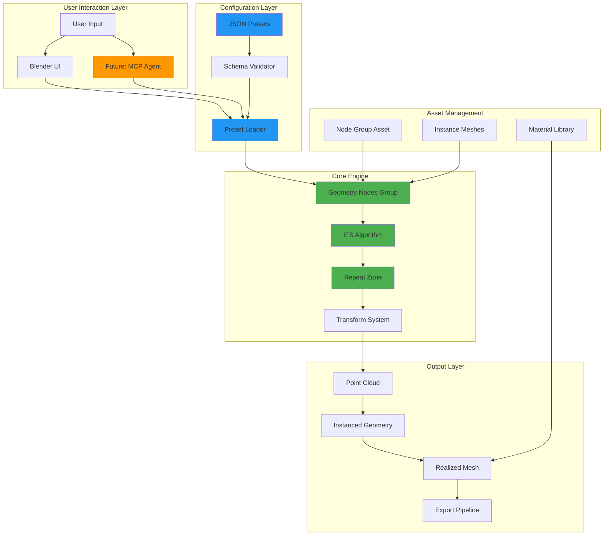
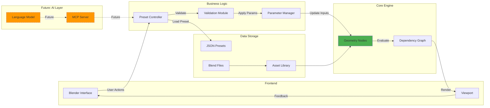
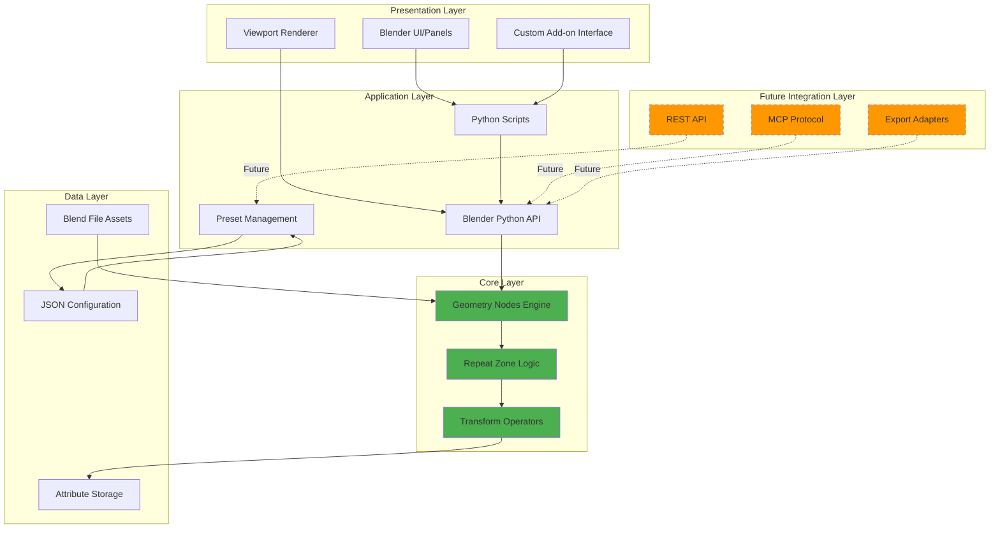
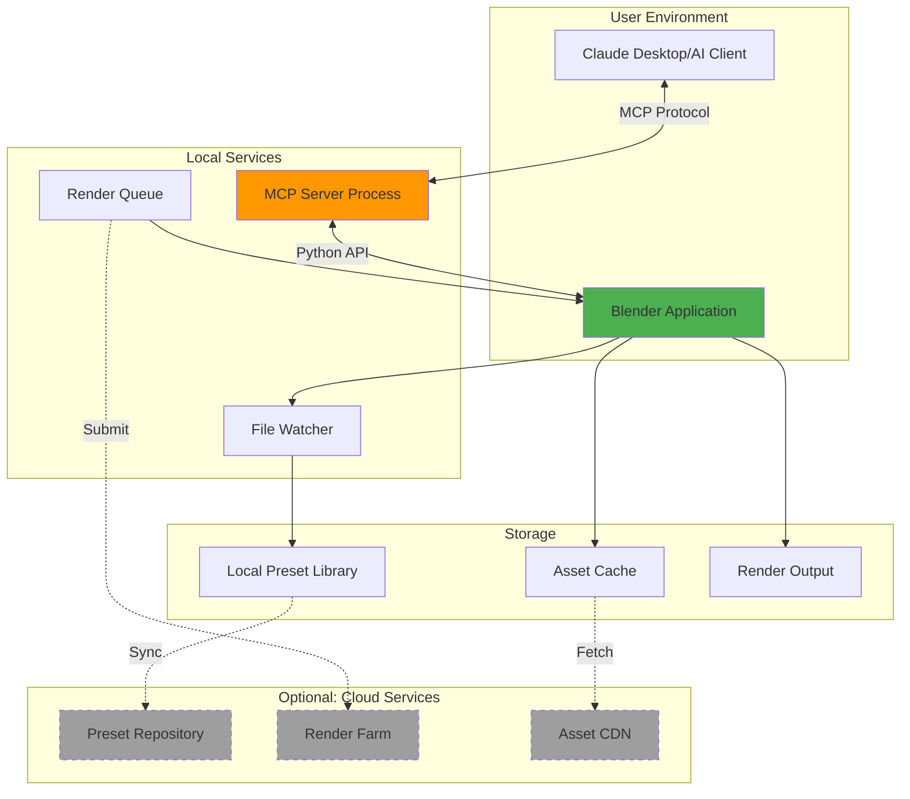
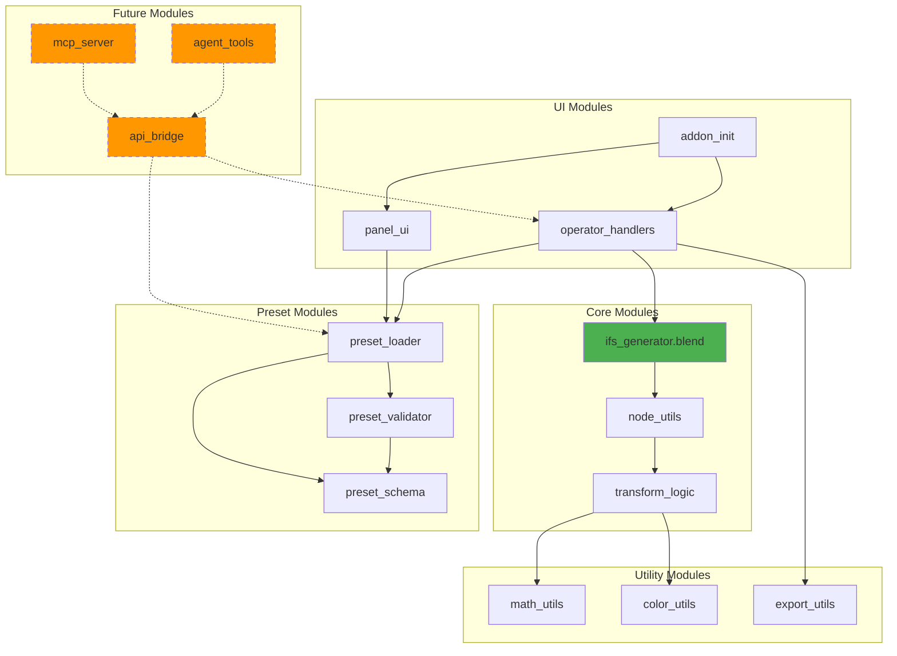

# System Overview Diagrams

## 1. High-Level System Architecture

This diagram shows the major components of the IFS Fractal Generator and their relationships.

---

## 2. Component Interaction Overview

This diagram illustrates how different system components communicate and depend on each other.

---

## 3. Technology Stack

Visual representation of the technology layers.

---

## 4. Deployment Architecture (Future State)

Shows how the system could be deployed with MCP integration.

---

## 5. Module Dependency Graph

Shows internal module dependencies within the project.

---

## Legend

- **Green**: Core geometry system (already implemented/in progress)
- **Blue**: Configuration and data management
- **Orange**: Future MCP/AI integration features
- **Gray**: Optional cloud services
- **Dashed Lines**: Planned but not yet implemented
- **Solid Lines**: Implemented or in active development

---

## Notes

- All diagrams represent both current state and planned architecture
- Dashed components indicate future phases (see `/docs/development-plan.md`)
- Core geometry nodes remain independent of future extensions
- MCP integration is non-invasive and can be added without modifying core engine

